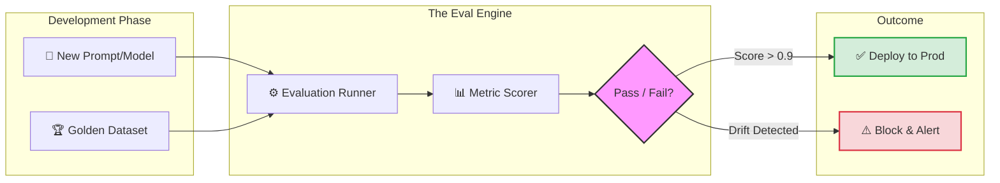

# LLM Evaluation & Reliability Platform  
### A reliability layer that prevents silent AI failures before they hit customers or revenue

This system is designed for companies running AI in production where incorrect outputs, regressions, and cost drift create real business risk — not just technical debt.

## The Business Risk This Addresses

Most AI failures do not crash systems.

They quietly:
- Degrade output quality
- Increase hallucinations
- Drift after model or prompt changes
- Inflate costs without obvious signals

By the time customers or internal teams notice, damage has already occurred.

This platform exists to surface those failures early — automatically, continuously, and audibly.

## Who This Is For

This platform is designed for:

- Founders and leadership teams responsible for AI-powered products
- Engineering teams operating LLMs in production
- Organizations where AI output quality directly impacts customers, revenue, or compliance
- Teams that cannot afford silent regressions or unreliable behavior

This is especially relevant once AI systems move beyond experimentation into core workflows.

## When to Use This

Use this platform when:

- AI correctness becomes a business requirement, not an assumption.
- LLM outputs must be evaluated continuously, not manually
- Regression, drift, or quality degradation is a concern
- Cost and latency need to be tracked alongside model quality

## Why This Project Exists
Most LLM failures are silent:
- Prompt regressions
- Hallucinations after model upgrades
- Latency spikes
- Cost overruns

This project focuses on **detecting and preventing those failures before production impact**.

These failures are rarely caught by traditional monitoring — which is why evaluation must be treated as a first-class production concern.

## Core Capabilities
- Regression evaluation on golden datasets
- Faithfulness and relevance checks
- Latency and cost awareness
- Drift detection across prompt/model changes
- Designed for local and hosted execution

## How This Fits Into Real Production Systems

In production environments, this platform acts as a reliability layer alongside:

- AI operations agents
- RAG or agentic workflows
- Customer-facing AI systems
- Internal decision copilots

It does not replace orchestration or inference systems.

It ensures those systems remain trustworthy over time.

🚀 Production Implementation: The "Safety Gate"
This platform is designed to be injected into the GitHub Actions / GitLab CI pipeline.

1.Commit: Developer modifies an agent's prompt.

2.Trigger: CI starts the LLM-Eval runner.

3.Validation: System runs the new prompt against 100+ "Golden" test cases.

4.Enforcement: If the Faithfulness Score drops by more than 5%, the Build is automatically failed, preventing a regression from hitting production.

## What This Is Not
- Not a UI-heavy dashboard
- Not a fine-tuning framework
- Not a research benchmark suite

This is a **reliability and evaluation layer**.

## Technical Walkthrough (Interview & Deep Review)

This section explains how to evaluate this project in a technical interview.

### 1. Problem This System Solves
Most LLM systems fail silently:
- Outputs degrade after prompt or model changes
- Hallucinations increase without triggering alerts
- Latency and uptime look healthy while semantic quality drops

Traditional monitoring does not catch these failures.
This platform focuses on **semantic reliability**, not just system health.

---

### 2. Core Design Decisions

**Golden Datasets Over Ad-Hoc Testing**  
Instead of manual spot checks, the system replays curated prompts
with clearly defined expected behavior to detect regressions.

**Evaluation-as-Code(EaC):**  
We treat test cases like unit tests. 
This allows for version-controlled reliability that scales with the codebase.

📈 Evaluator Suite (Metrics)
This platform implements the "Trinity of Groundedness" to ensure semantic integrity:

Faithfulness (NLI): Measures if the answer is derived only from the provided context (Anti-Hallucination).

Answer Relevance: Evaluates if the response actually addresses the user's intent without "fluff."

Context Precision: Ensures the Retrieval Layer is not injecting "noisy" data that confuses the model.

Semantic Similarity (BERTScore): Detects intent drift between model versions (e.g., GPT-4 vs GPT-4o).

**Stateless and Model-Agnostic**  
Evaluation logic is decoupled from any specific model or vendor,
making upgrades and comparisons safe.

**Cheap by Design**  
Evaluations are intentionally lightweight so they can run:
- Locally before merges
- In CI/CD pipelines
- Periodically in production environments

---

### 3. Failure Modes This Platform Catches
- Silent hallucination increases after model upgrades
- Prompt regressions caused by small wording changes
- Output quality degradation with stable latency and uptime
- Policy or refusal behavior drift

A detailed example is documented in `FAILURE_MODE_CASE_STUDY.md`.

---

### 4. Local vs Hosted Execution
The same evaluation logic runs in both environments:
- **Local**: Developer validation before changes ship
- **Hosted**: Continuous regression and drift detection

Only configuration and scheduling differ.

---

### 5. Cost-Aware Sampling:
In production, evaluating 100% of traffic is too expensive. 
I would implement a 5% "Shadow Evaluation" strategy to monitor live drift without doubling token costs.

---

## Business Impact When Deployed Correctly

When integrated into production workflows, this platform:

- Detects quality regressions before customers do
- Prevents silent cost and latency drift
- Makes AI systems safer to rely on for real decisions
- Builds organizational confidence in AI outputs

This is what allows teams to scale AI usage responsibly.

### 6. Why This Matters
LLM reliability is not about preventing crashes.
It is about **preventing incorrect outputs that look correct**.

This project demonstrates how to design systems
that catch those failures before users do.

## How This Is Used in Practice

This platform is typically deployed as part of a broader AI systems engagement, alongside:

- AI operations agents
- Internal copilots
- Revenue or support automation

Its role is to ensure those systems remain reliable as they evolve.

Reliability compounds. Neglect compounds faster.

